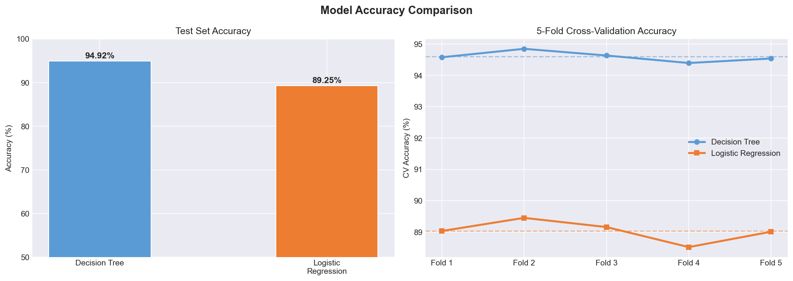
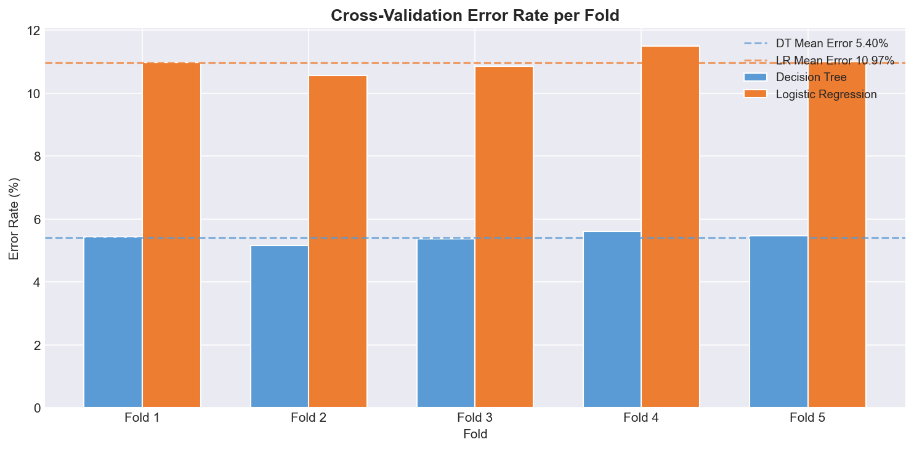
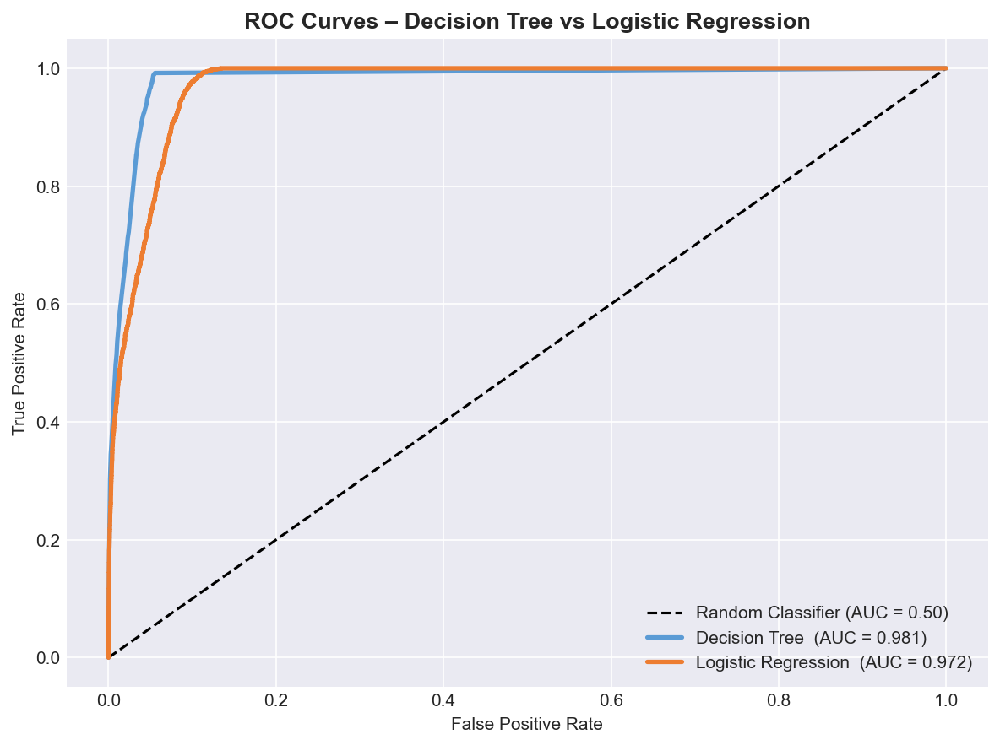
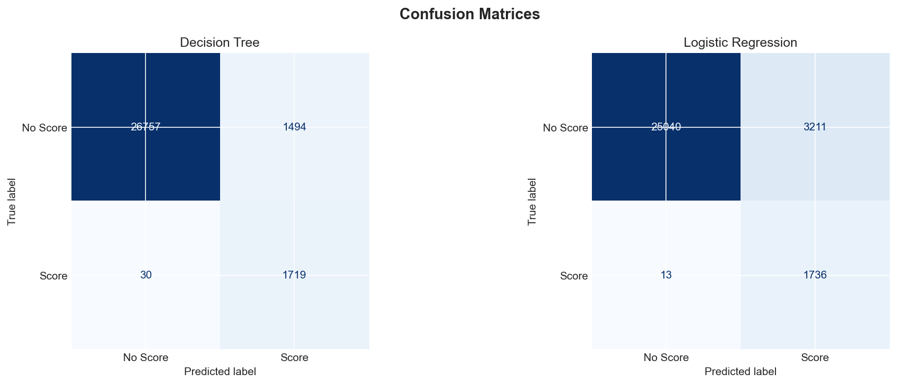

# Rocket League Goal-Scoring Prediction

**Course:** IB Computer Science HL — Final Machine Learning Project
**Year:** Senior Year

## Description

A binary classification project predicting whether a team will score within the next 10 seconds of game time, using real-time data from thousands of Rocket League matches. Features include ball position and velocity, per-player boost levels, and player positions. A Decision Tree is the primary model, with Logistic Regression included for comparison. Engineered features — ball speed, distance to each goal, team average boost, and minimum player-to-ball distance — are derived from raw positional data.

---

## Files

| File | Purpose |
|---|---|
| `rocket_league.py` | Full pipeline: feature engineering, 7 EDA visualizations, Decision Tree and Logistic Regression training, ROC curves, confusion matrices, and CV error analysis |

---

## Required Dataset

Download `train_0.csv` from Kaggle and update the path in the script:

```python
DATA_PATH = '/path/to/train_0.csv'
```

> The full dataset contains ~2,149,381 rows. The script draws a stratified sample of 150,000 rows to keep training time manageable while preserving the ~5.8% positive class ratio.

---

## Requirements

```bash
pip install pandas numpy matplotlib seaborn scikit-learn
```

---

## How to Run

```bash
python rocket_league.py
```

All output figures are saved to `SAVE_DIR` (default: same directory as the script). Update this path at the top of the file if needed.

---

## Feature Engineering

| Feature | Description |
|---|---|
| `ball_speed` | Magnitude of ball velocity vector |
| `dist_to_goal_A` / `dist_to_goal_B` | Euclidean distance from ball to each goal |
| `team_A_avg_boost` / `team_B_avg_boost` | Mean boost across each team's three players |
| `team_A_avg_y` / `team_B_avg_y` | Mean Y-position (field depth) per team |
| `team_A_min_dist` / `team_B_min_dist` | Closest player-to-ball distance per team |

---

## Model Configuration

| Setting | Decision Tree | Logistic Regression |
|---|---|---|
| Key hyperparameters | `max_depth=8`, `min_samples_leaf=20` | `C=0.1`, `solver=lbfgs` |
| Class imbalance handling | `class_weight='balanced'` | `class_weight='balanced'` |
| Scaling | None (tree-based) | StandardScaler |
| Cross-validation | StratifiedKFold (5 folds) | StratifiedKFold (5 folds) |

---

## Output Figures

| File | Content |
|---|---|
| `rl_vis1_class_distribution.png` | Class balance for both teams |
| `rl_vis2_ball_position_heatmap.png` | Ball position heatmap: score vs. no score |
| `rl_vis3_ball_speed_kde.png` | Ball speed distribution by outcome |
| `rl_vis4_distance_vs_probability.png` | Scoring probability vs. distance to goal |
| `rl_vis5_time_vs_probability.png` | Scoring probability over game time |
| `rl_vis6_boost_by_outcome.png` | Team boost distribution by scoring outcome |
| `rl_vis7_ball_height.png` | Ball height (Z) distribution by outcome |
| `rl_dt_tree_diagram.png` | Decision tree diagram (top 3 levels) |
| `rl_dt_feature_importance.png` | Top 15 features by Gini importance |
| `rl_accuracy_comparison.png` | Test accuracy and 5-fold CV accuracy |
| `rl_confusion_matrices.png` | Confusion matrices for both models |
| `rl_roc_curves.png` | ROC curves with AUC for both models |
| `rl_cv_error_rates.png` | CV error rate per fold for both models |

---

## Key Concepts

- Stratified sampling to preserve minority class ratio
- Feature engineering from raw 3D positional and velocity data
- Decision tree interpretability via `plot_tree` and feature importance
- Handling class imbalance (~94/6 split) with `class_weight='balanced'`
- ROC-AUC as primary evaluation metric for imbalanced classification

---

## Results

Both models were evaluated on a held-out test set (20% of the 150,000-row stratified sample) and validated with 5-fold cross-validation.

### Accuracy & 5-Fold Cross-Validation


The left panel shows test set accuracy for both models. The right panel shows 5-fold CV accuracy per fold, with dashed lines marking each model's mean. The Decision Tree and Logistic Regression perform similarly across all five folds, indicating stable generalization rather than overfitting to the training split.

### Cross-Validation Error Rate per Fold


Error rates broken down by fold for both models. The consistent spread across folds confirms that neither model is sensitive to how the data is split, which is a strong indicator of a reliable classifier given the class imbalance (~94% negative, ~6% positive).

### ROC Curves


ROC curves comparing both models against a random baseline. AUC scores above 0.5 confirm that both classifiers meaningfully distinguish scoring frames from non-scoring frames — a non-trivial task given the rarity of goal-scoring moments in real match data.

### Confusion Matrices


Confusion matrices showing predicted vs. true class for both models. The `class_weight='balanced'` setting ensures neither model collapses to predicting the majority class (no score) for every frame.
